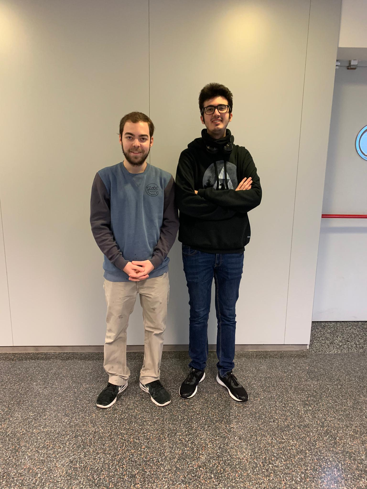
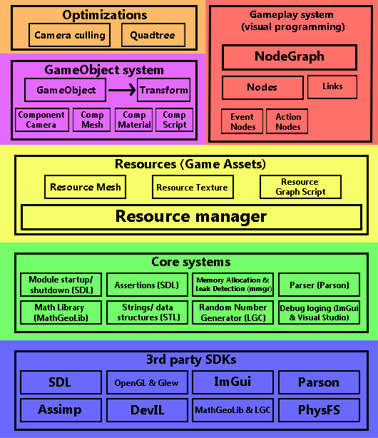
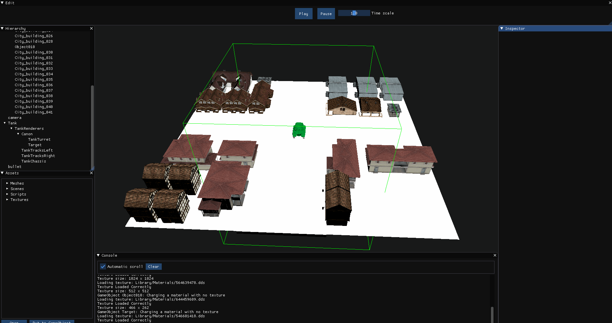
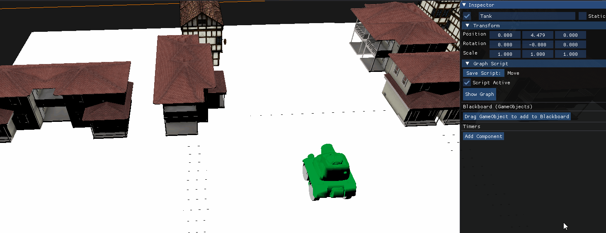
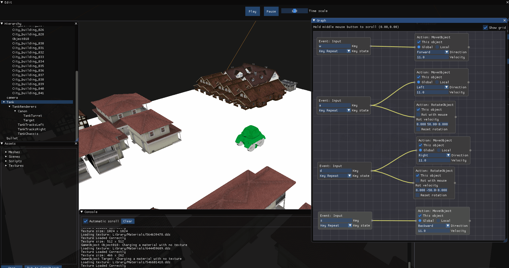
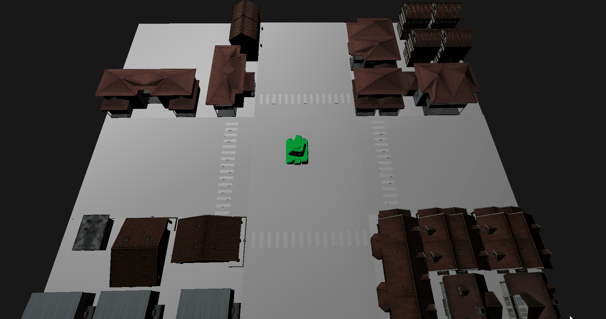

Stardust Engine is a 3D engine student project, made by [Ricardo Gutiérrez](https://twitter.com/reRikarudo) & [David Valdivia](https://twitter.com/ValdiviaDev), students at the CITM university (UPC affiliate) at Terrassa (Barcelona).

## The team

### List of tasks done
Ricardo Gutiérrez

	- Model charge with assimp
	- GameObject system
	- Transform system for the GameObjects
	- Material importer system
	- Camera component and camera culling
	- Scene serialization
	- Resource manager: offline part
	
	 3rd assignment (Visual Scripting)
	- Graph node visual implementation
	- Saving and loading scripts
	- Scene serialization of component script

David Valdivia

	- Texture chare with DevIL
	- GameObject system
	- Mesh and material components systems
	- Mesh/scene importer system
	- Engine camera refactoring
	- Mouse picking and gizmos implementation
	- Quadtree and quadtree optimizations (camera culling and mouse picking)
	- Time manager (game and engine times)
	- Resource manager: runtime part
	
	3rd assignment (Visual Scripting)
	- Graph node visual scripting sctructure
	- Nodes functionality
	- Component graph script functionality

## Main core sub-systems
Stardust Engine is programmed in c++, using OpenGL as the graphics library and SDL for low level systems, amongst several other 3rd party libraries. This is a Unity-like engine, constructed in a similar fashion, so it has a resource manager system to manage game assets (resources) and the memory they consume. These resources are used in GameObjects, which are the base entities that compose a game.
The engine counts with a Visual Programming system using node graphs and two performance optimizations, in the form of camera culling and a Quadtree.

### Optimizations

*Camera Culling optimization*

*Quadtree optimization*

## NodeGraph visual programming
This engine counts with a visual scripting system using node graphs. This serves the purpose to program something in-game directly using a visual system integraded into the engine itself. It is mostly useful for people that don't know how to code or know only the basics.

### Component graph script
- In this component you can create a new script or drag a preexisting script from assets.
- You can drag GameObjects to the Blackboard, to use it as a reference in the NodeGraph script
- The timers you use in the NodeGraph will be shown here in the component.
	
### Blackboard
The component graph script has a blackboard for GameObject references that you can use in a NodeGraph of the object the component is on. To put a reference to the blackboard, simply drag a GameObject to the button that says to drag the GameObject to the blackboard

The blackboard also has a list of timers that shows the time progress of the graph's timers. 

### NodeGraph functionality
- Click "Show Graph" and "Hide Graph" in the Component graph script to show or hide a window showcasing the node graph.
- Inside the graph, mouse right click to create a new node.
- Inside the graph, mouse left click to select a node, move it or change its variables.
- There are two types of nodes:
	* Events: Are always updating and when the event specified in the node happens, all the outputs connected to it start to update.
	* Actions: Need to have an event or another action as an input. Theese nodes make that something happen with a GameObject, scene or another game interaction.

Actions can be connected to other actions, to make an on-chain reaction and events can be connected to other events if the user wants to use a multiple event (example: move the mouse and press a key). Events can be also connected to actions if the user wants something to occur in some specific situations (example: while an object is moving right, pressing the mouse makes it stop).
	
### Nodes
 
**Events**
   * **Key input** -> Condition: Pressing a keyboard key.
   * **Mouse input** -> Condition: Pressing a mouse button.
   * **Mouse Move** -> Condition: Moving the mouse inSIDE the screen.
   * **Timer** -> Condition: When a timer arrives to a certain time determined by the user an action happens. The timer can be reset or be told to repeat the action when the timer reaches the determined time.
 
**Actions**
  * **Move Object** -> Function: Move a GameObject in an axis globally (world coordinates) or locally
  * **Rotate Object** -> Function: Rotate a GameObject. It can be rotated in an axis globally using an event or using the mouse movement. If using the mouse, the user can choose if only to rotate when mouse is moving in the X-axis of the screen, the Y-axis or both.
  * **Active Object** -> Function: Enable or disable GameObject.
  * **Active Component** -> Function: Enable or disable a GameObject component.
  * **Instantiate GameObject** -> Function: Create a GameObject from an already existing GameObject. If the GameObject is inactive, this action will automatically activate it. The instantiated object can be put in a position and rotation determined bt the user, or put it in the position and rotation of a reference GameObject.
  * **Delete GameObject** -> Function: Delete a GameObject.
  * **Load Scene** -> Function: Load an alredy existing scene.
  * **Log to Console** -> Function: Log a text to the engine's console.

*Using the NodeGraph*

### NodeGraph notification system
The nodes in the graph notify the user of the engine of which state is the node in, depending in the colour of the outline of the node.
- No colour: The node is not updating.
- Green: The node is updating.
- Orange: The node is waiting for something to update (example: the timer waits for the time to be the one determined by the user).
- Red: The node wanted to update but encountered an error (example: a GameObject reference is NULL).

*Visual scripting functionality*

### Demo
When you open the engine there, there's a demo of a tank that moves, rotates and shoots balls in game mode.
  
Controls:
  * WASD: Move Tank
  * Left mouse button: Shoot a ball
  * Mouse movement: move tank turret to aim
  * R: reset the turret's position

*Demo in GAME MODE*

## Engine video demonstration
<iframe width="560" height="315" src="https://www.youtube.com/embed/4TpnDBCI7zk" frameborder="0" allowfullscreen></iframe>

## Links

- [**Github repository**](https://github.com/ValdiviaDev/Stardust-Engine)
- [**Latest Release**](https://github.com/ValdiviaDev/Stardust-Engine/releases/tag/Assignment3.1)

## License:

MIT License

Copyright (c) 2019 Ricardo Gutiérrez & David Valdivia

Permission is hereby granted, free of charge, to any person obtaining a copy
of this software and associated documentation files (the "Software"), to deal
in the Software without restriction, including without limitation the rights
to use, copy, modify, merge, publish, distribute, sublicense, and/or sell
copies of the Software, and to permit persons to whom the Software is
furnished to do so, subject to the following conditions:

The above copyright notice and this permission notice shall be included in all
copies or substantial portions of the Software.

THE SOFTWARE IS PROVIDED "AS IS", WITHOUT WARRANTY OF ANY KIND, EXPRESS OR
IMPLIED, INCLUDING BUT NOT LIMITED TO THE WARRANTIES OF MERCHANTABILITY,
FITNESS FOR A PARTICULAR PURPOSE AND NONINFRINGEMENT. IN NO EVENT SHALL THE
AUTHORS OR COPYRIGHT HOLDERS BE LIABLE FOR ANY CLAIM, DAMAGES OR OTHER
LIABILITY, WHETHER IN AN ACTION OF CONTRACT, TORT OR OTHERWISE, ARISING FROM,
OUT OF OR IN CONNECTION WITH THE SOFTWARE OR THE USE OR OTHER DEALINGS IN THE
SOFTWARE.
  
